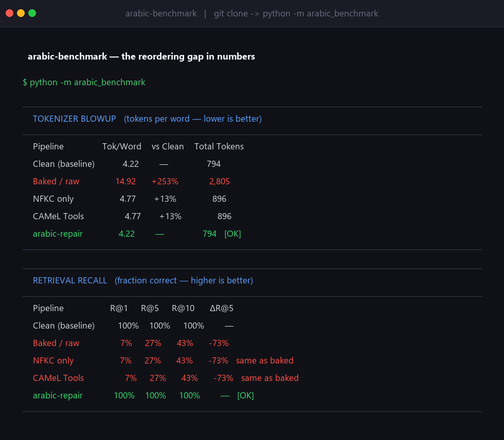

# arabic-benchmark

**Benchmark proving the visual-order reordering gap in Arabic NLP pipelines.**

[](LICENSE)
[](https://huggingface.co/spaces/balswyan/arabic-nlp)

**[🤗 Live demo](https://huggingface.co/spaces/balswyan/arabic-rt)** · **[📖 Article](https://huggingface.co/spaces/balswyan/arabic-nlp)**

Measures tokenizer blowup and retrieval recall across five text pipelines on a 30-sentence
Arabic corpus. Shows that NFKC normalization and CAMeL Tools both fail to restore retrieval
recall after visual-order contamination — because they fix the codepoints but not the word order.



## The findings

Measured on 30 MSA sentences (188 words) with **GPT-4 tokenizer (cl100k_base)** and
**paraphrase-multilingual-MiniLM-L12-v2** embeddings. Reproducible with the commands below.

| Pipeline | Tok/Word | vs Clean | R@5 | vs Clean |
|---|---:|---:|---:|---:|
| Clean (baseline) | 4.22 | — | 100% | — |
| **Baked / raw** | **14.92** | **+253%** | 27% | **−73%** |
| NFKC only | 4.77 | +13% | 27% | −73% ← **same as baked** |
| CAMeL Tools \* | 4.77 | +13% | 27% | −73% ← **same as baked** |
| **arabic-repair** | **4.22** | **0%** | **100%** | **0%** |

NFKC removes the presentation-form characters so token cost drops. It cannot restore
reversed word order — retrieval recall stays at 27%, identical to uncleaned baked text.
`arabic-repair` fixes both.

> **\* Note on the CAMeL Tools column.** If `camel-tools` is not importable in your
> environment (e.g. Python 3.14), the benchmark falls back to plain NFKC for this column
> and prints `CAMeL Tools: not available (using NFKC fallback)`. Install `camel-tools` to
> measure it directly; results are expected to match the NFKC row, because CAMeL's
> `normalize_unicode` is NFKC plus character-level variant folding and does **not** reorder
> words — exactly the gap this benchmark isolates.

## Install & run

The benchmark runs from source (it is not published to PyPI):

```bash
git clone https://github.com/balswyan/arabic-benchmark.git
cd arabic-benchmark
pip install -e .[all]                         # tiktoken + sentence-transformers (~120 MB model on first run)

python -m arabic_benchmark                     # full benchmark
python -m arabic_benchmark --no-retrieval      # tokenizer only, no model download
python -m arabic_benchmark --json              # machine-readable output
```

## Programmatic use

```python
from arabic_benchmark import run_benchmark

result = run_benchmark(run_retrieval=False)   # tokenizer-only for speed
print(result.tokenizer_table)
print(result.to_json())
```

## Ecosystem

| Package | Purpose |
|---|---|
| [arabic-rt](https://github.com/balswyan/arabic-rt) | Core engine: shape / fix / unfix. |
| [arabic-repair](https://github.com/balswyan/arabic-repair) | Detect + repair visual-order contamination. |
| [arabic-extract](https://github.com/balswyan/arabic-extract) | PDF + image extraction pipeline. |
| **arabic-benchmark** ← you are here | Prove the gap with reproducible numbers. |

## License

MPL-2.0 — by Bandar AlSwyan
